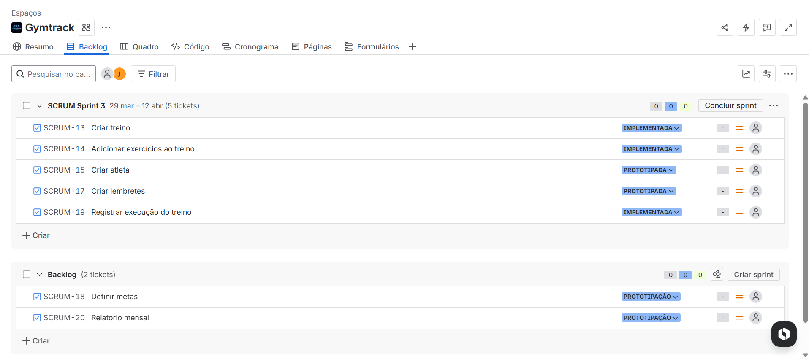
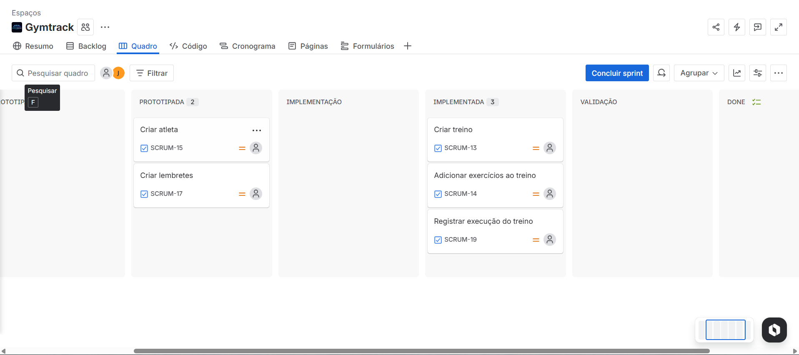
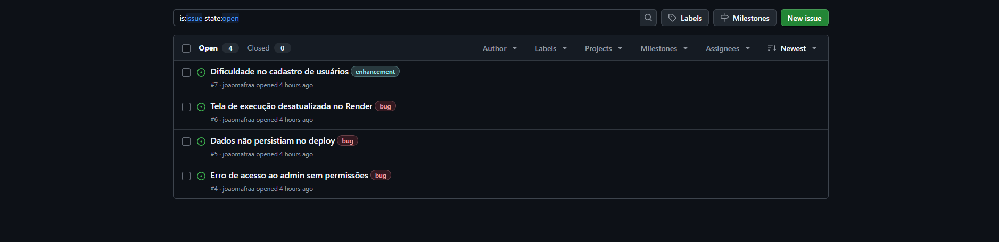

# GymTrack


> Sistema Web para Gerenciamento de Treinos de Academia

---

## Sobre o Projeto

O **GymTrack** é uma aplicação web desenvolvida para auxiliar praticantes de academia a organizarem, registrarem e acompanharem seus treinos de forma estruturada e eficiente.

---

## Integrantes

* Marcelo Fonseca  maf@cesar.school
* João Mafra  jcmsn@cesar.school
* João Cláudio Beltrão  jccbf@cesar.school
* Vinícius Cezar  vcrc@cesar.school
* Mateus Reinaux  mrbm@cesar.school
* Arthur Rodrigues de Andrade  ara@cesar.school
* João Lucas  jlogb@cesar.school

---

## Links Úteis

- **Jira (Gerenciamento do Projeto)**  
[Quadro do Jira](https://gymtrackteam.atlassian.net/jira/software/projects/SCRUM/boards/1?atlOrigin=eyJpIjoiZDc0NzljNTI3MzI0NDMyNjhkYTE3MWZlMjY5Y2FkNzIiLCJwIjoiaiJ9)

- **Protótipo no Figma**  
[Figma](https://www.figma.com/design/M1Hfn6B0tpHr6jeCbv1qkx/GymTrack-Lo-Fi?node-id=0-1&t=iEJrpFB0mVRo6zEF-1)

- **Documento do Projeto**  
[Docs](https://docs.google.com/document/d/1_7_Va8dvJpgzO_IRk2-y4eVUFT7FXoAKBGFNV3WwMas/edit?usp=sharing)

- **Link deploy**  
[Deploy](https://gymtrack-nnjj.onrender.com)
---

## Entregas do Projeto

<details>
<summary>Prototipo 1 — Figma</summary>

O projeto está sendo gerenciado utilizando a metodologia **Scrum**.

### Backlog do Produto


### Quadro da Sprint 1


### Screencast
[Assistir vídeo](https://youtu.be/a5PJF1hkWF8)

</details>

---

<details>
<summary>Entrega 2— Implementação 1</summary>

Conteúdo da segunda entrega.

 
 

### Screencast
[Assistir vídeo](https://youtu.be/iKUwFJXq368)

## Relatos de Pair Programming

Durante o desenvolvimento do *GymTrack, adotamos a prática de *pair programming em diferentes etapas do projeto, especialmente nas partes mais críticas da implementação. As atividades foram realizadas em reuniões via Discord, com compartilhamento de tela, permitindo colaboração em tempo real e alinhamento técnico entre os integrantes.

A equipe foi organizada em dois núcleos principais:

- *Núcleo de Implementação:* responsável pelo desenvolvimento do sistema, incluindo backend e frontend. Esse grupo atuou diretamente na codificação das funcionalidades, integração das páginas e ajustes na interface, garantindo que o sistema estivesse funcional de acordo com os requisitos.

- *Núcleo de Planejamento:* responsável pela definição da estrutura do sistema, organização das funcionalidades, construção das histórias de usuário e alinhamento das decisões técnicas. Esse grupo teve papel fundamental na orientação do desenvolvimento e validação das soluções implementadas.

Essa divisão permitiu maior eficiência no fluxo de trabalho, com foco simultâneo na execução técnica e na qualidade das decisões do projeto.

As reuniões foram realizadas principalmente via *Discord*, utilizando compartilhamento de tela para desenvolvimento colaborativo e resolução de problemas. A comunicação contínua entre os integrantes foi mantida por meio da própria plataforma, onde eram definidos prazos, distribuídas tarefas e acompanhada a evolução do projeto.

Mesmo com a divisão de responsabilidades, houve constante interação entre os núcleos, garantindo que o sistema fosse desenvolvido de forma consistente, alinhada e dentro dos critérios estabelecidos

</details>

---

<details>
<summary>Entrega 3 — Implementação 2</summary>

Conteúdo da terceira entrega.

- Implementação das funcionalidades principais  
- Integração com banco de dados  
- Testes iniciais  

</details>

---

<details>
<summary>Entrega 4 — Versão Final</summary>

Conteúdo da entrega final.

- Sistema completo  
- Melhorias de interface  
- Apresentação final  

</details>

---

## Licença

Projeto acadêmico desenvolvido para fins educacionais.  
Disciplina: **Fundamentos de Software**

---

## CI/CD e Testes E2E

### Pipeline no GitHub

O projeto possui uma pipeline de `CI/CD` em [`.github/workflows/ci-cd.yml`](.github/workflows/ci-cd.yml) com quatro etapas:

1. `tests`: executa os testes unitarios e de integracao do Django.
2. `build`: valida migracoes pendentes, configuracao do projeto e `collectstatic`.
3. `e2e`: executa testes de sistema automatizados com Playwright em navegador real.
4. `deploy`: dispara o deploy continuo no Render somente quando o `push` para `main` passa em todas as verificacoes anteriores.

### Testes de Sistema Automatizados

Os testes `E2E` foram implementados em [core/tests_e2e.py](core/tests_e2e.py) e cobrem fluxos reais do usuario:

- cadastro de conta
- criacao de treino
- adicao de exercicio ao treino
- inicio e conclusao de execucao
- criacao e confirmacao de meta

### Como rodar localmente

```bash
pip install -r requirements-dev.txt
python -m playwright install chromium
python manage.py test --exclude-tag=e2e
python manage.py test --tag=e2e
```

### Configuracao necessaria

No GitHub, configure o secret:

- `RENDER_DEPLOY_HOOK_URL`

No Render, configure as variaveis de ambiente do servico:

- `DATABASE_URL`
- `DJANGO_SECRET_KEY`
- `ADMIN_USERNAME`
- `ADMIN_EMAIL`
- `ADMIN_PASSWORD`

### Screencasts da Entrega 3

Substitua os links abaixo pelos videos reais publicados no YouTube antes da entrega:

- [Screencast do processo de build e deployment](https://www.youtube.com/)
- [Screencast da execucao dos testes E2E](https://www.youtube.com/)
