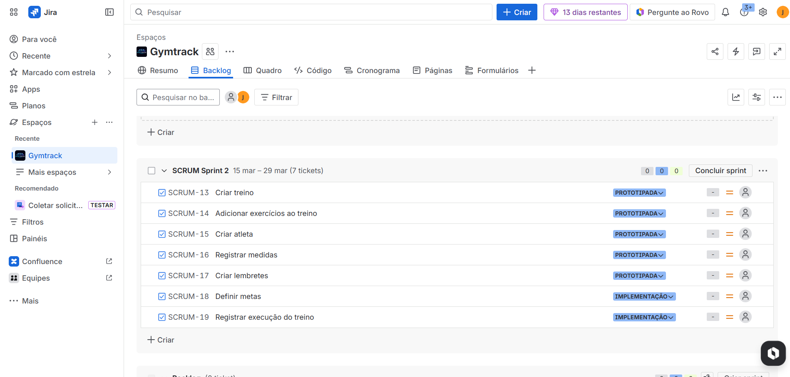
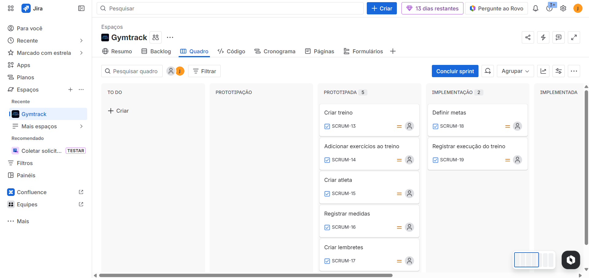

# GymTrack

> Sistema Web para Gerenciamento de Treinos de Academia

---

## Sobre o Projeto

O **GymTrack** é uma aplicação web desenvolvida para auxiliar praticantes de academia a organizarem, registrarem e acompanharem seus treinos de forma estruturada e eficiente.

---

## Integrantes

* Marcelo Fonseca  maf@cesar.school
* João Mafra  jcmsn@cesar.school
* João Cláudio Beltrão  jccbf@cesar.school
* Vinícius Cezar  vcrc@cesar.school
* Mateus Reinaux  mrbm@cesar.school
* Arthur Rodrigues de Andrade  ara@cesar.school
* João Lucas  jlogb@cesar.school

---

## Links Úteis

- **Jira (Gerenciamento do Projeto)**  
[Quadro do Jira](https://gymtrackteam.atlassian.net/jira/software/projects/SCRUM/boards/1?atlOrigin=eyJpIjoiZDc0NzljNTI3MzI0NDMyNjhkYTE3MWZlMjY5Y2FkNzIiLCJwIjoiaiJ9)

- **Protótipo no Figma**  
[Figma](https://www.figma.com/design/M1Hfn6B0tpHr6jeCbv1qkx/GymTrack-Lo-Fi?node-id=0-1&t=iEJrpFB0mVRo6zEF-1)

- **Documento do Projeto**  
[Docs](https://docs.google.com/document/d/1_7_Va8dvJpgzO_IRk2-y4eVUFT7FXoAKBGFNV3WwMas/edit?usp=sharing)

---

## Entregas do Projeto

Entrega 1 — Kickoff

O projeto está sendo gerenciado utilizando a metodologia **Scrum**.

### Backlog do Produto

### Quadro da Sprint 1

### Screencast
[Assistir vídeo](https://youtu.be/zOUuL4RQky8)

---

Entrega 2 — Protótipo

Conteúdo da segunda entrega.

- Protótipo de interface  
- Modelagem inicial do sistema  
- Atualização das histórias de usuário  

---

Entrega 3 — Implementação

Conteúdo da terceira entrega.

- Implementação das funcionalidades principais  
- Integração com banco de dados  
- Testes iniciais  

---

Entrega 4 — Versão Final

Conteúdo da entrega final.

- Sistema completo  
- Melhorias de interface  
- Apresentação final  

---

## Licença

Projeto acadêmico desenvolvido para fins educacionais.  
Disciplina: **Fundamentos de Software**
